# Git Version Control Basics

This is a simple HTML/CSS/JS portfolio website used to simulate Git collaboration between two developers: **Tom** and **Jerry**.

## Git Workflow Tasks

* Tom adds a "Blog" link to the navigation.
* Jerry adds contact info in the footer.

## Files

* `index.html`: Main HTML file
* `styles.css`: Basic styling
* `script.js`: Optional JS 

## Note

> This collaboration is **simulated by a single developer** on **one Ubuntu machine**, using a **single Git user/account** and different **GitHub accounts**. The tasks of **Tom** and **Jerry** are actioned by performing their respective tasks as separate commits, representing a collaborative workflow within a solo environment.
>Screenshots provided in this README clearly indicate which task was completed by Tom and which by Jerry, to make the collaboration simulation easy to follow.

---

## Mini Project Tasks
**Both Tom and Jerry has git installed**
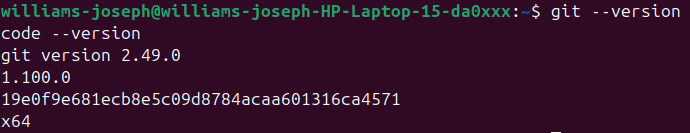

---
**Both Tom and Jerry cloned the repository**
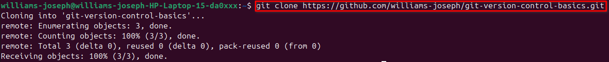

---
**Dummy Website for simulation**
---
A simple portfolio website was written in the local repository, hereby adding `html`,`css` and `js` files. This where all committed and pushed to the remote repository.

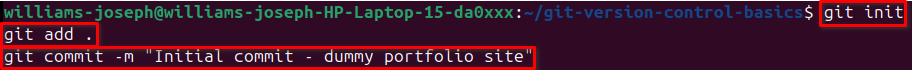

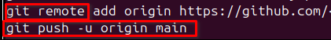

> Understanding what `-u` and `remote` commands do.

`remote add` Tells Git we're connecting the local repo to a remote version of the project hosted on GitHub (remote repo).

`-u` This links the local branch to the remote branch

---

**Both made branches and modified the root**

Tom creates a new branch `update-navigation`

---

Tom made code changes adding the Blog, commits then push.
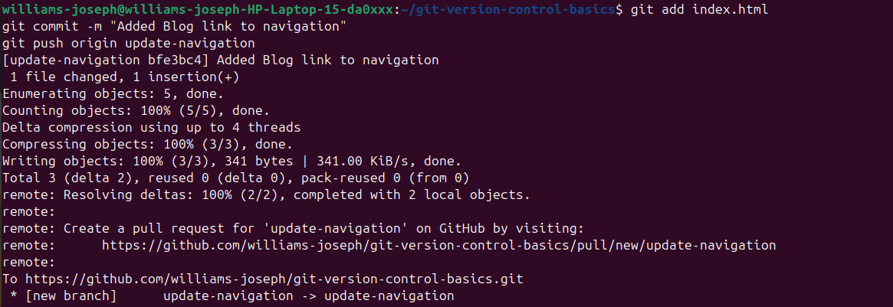

---
Jerry creates a new branch `add-contact-info`

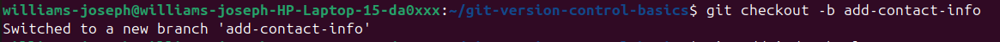

---
Jerry made code changes adding the Contact Info, commits then push.
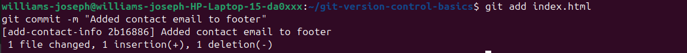

---
Jerry syncs with Tom's latest changes
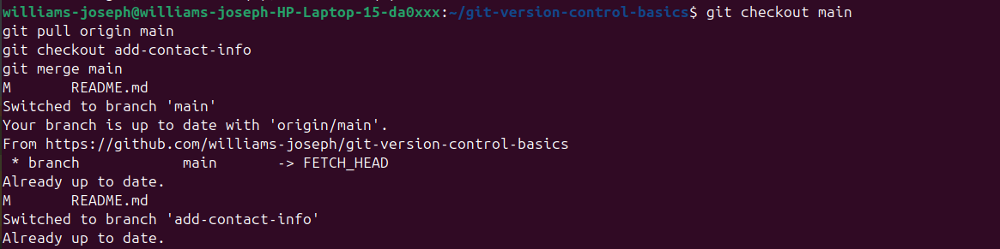

---
Jerry pushes after merge

---

## Reviewing Pull Requests

**Tom Reviews Jerry's PR**
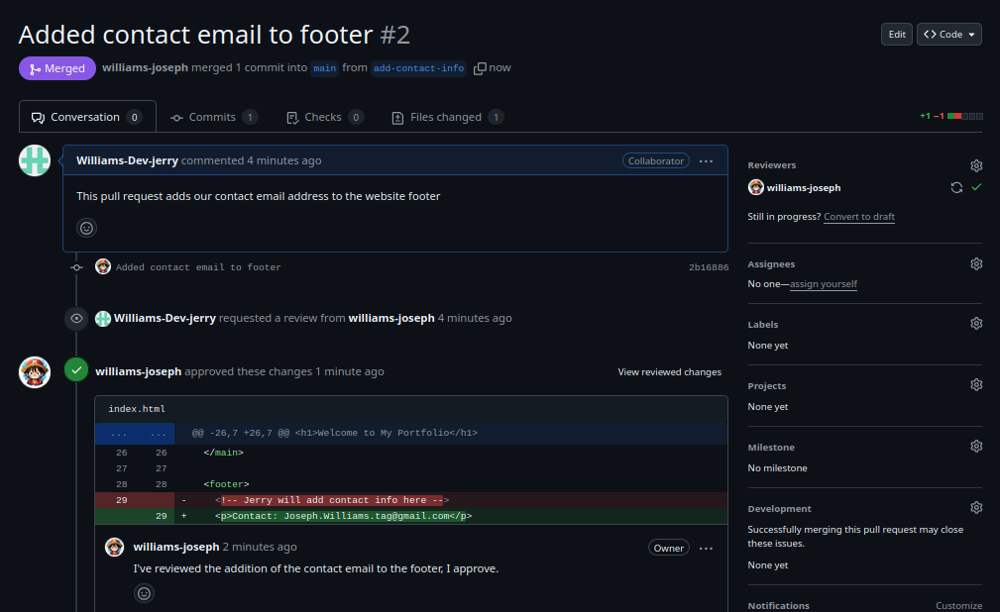

---
**Jerry Reviews Tom's PR**

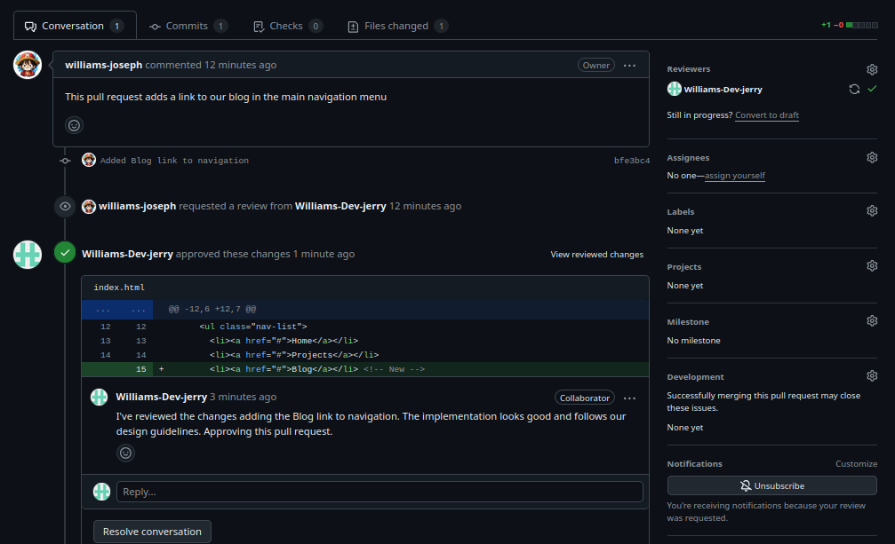

---
## Final Steps

After the two PRs are merged, I updated the local main branch with the `git pull` command.

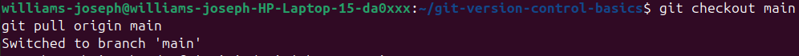

